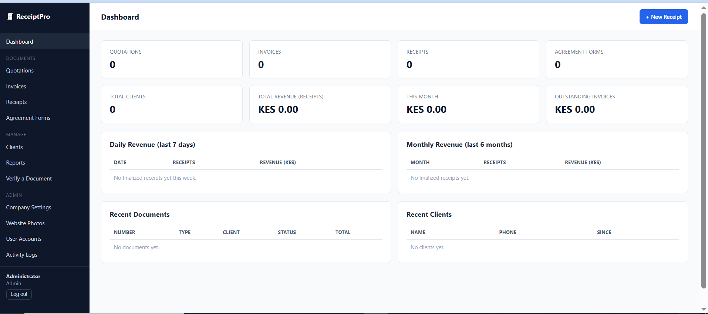
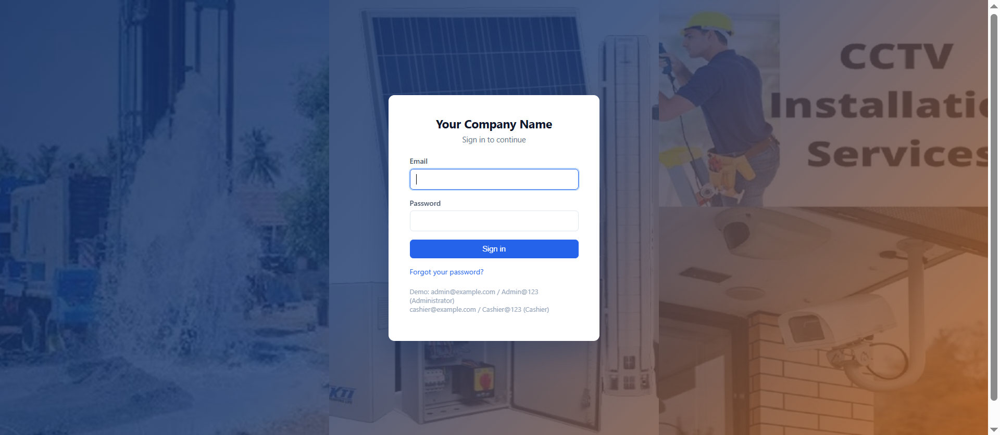
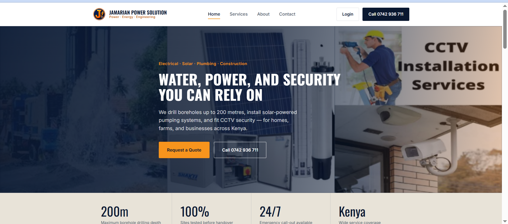
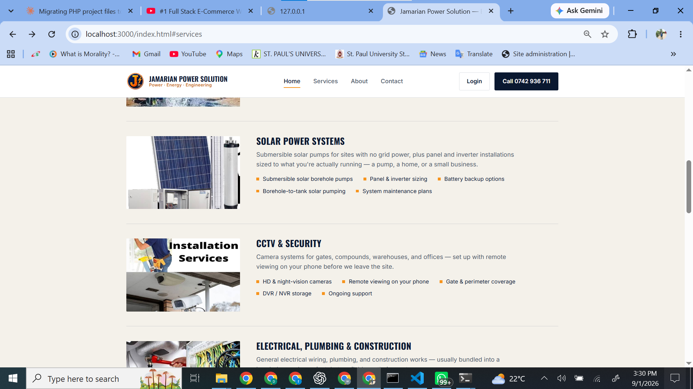

# Receipt & Client Management System

A full-stack business document and client management platform: quotations, invoices, receipts,
and agreement forms, all backed by a shared client database, a public document verification
system, a dashboard, reports, and role-based user accounts. Built by **Dantechdevs Developers**
([dantechdevelopers.com](https://dantechdevelopers.com)).

Originally built as a receipt system, it has grown into a full document suite for
service-based businesses (e.g. power/solar/CCTV installers, contractors) that need to issue
quotations, convert them to invoices, record payment receipts, and generate signed agreement
forms — all under one company branding.

## Screenshots

**Admin Dashboard**


**Login**


**Demo Public Site — Home** (Jamarian Power Solution, seeded demo company)


**Demo Public Site — Services**


## Features

- **Multi-Document Suite** — Quotations, Invoices, Receipts, and Agreement Forms as a unified
  document model, each with its own numbering sequence, status (draft/final), and PDF layout
- **Company Settings** — logo, stamp, signature upload; name, address, contact info, and
  document footer text
- **Auto-Generated Numbering & Verification** — sequential document numbers
  (e.g. `RCP-2026-000125`), unique verification codes, and QR codes on every finalized document
- **Professional PDF Output** — branded A4 PDF layout with logo, stamp, signature, and QR code;
  print preview and duplicate copies
- **Client Management** — clients are auto-created from documents, searchable, with full
  transaction history and total spend per client
- **Document Management** — search by number/verification code/client name, filter by date
  range, reprint, edit drafts, duplicate; finalized documents are locked from editing
- **Verify a Document** — public verification page + QR code that resolves to it, so anyone can
  confirm a document is genuine
- **Website Photos** — manage the gallery/media used on the company's public marketing site from
  within the admin panel
- **Dashboard** — live totals for quotations, invoices, receipts, and agreement forms; total
  clients; total and monthly revenue; outstanding invoices; daily revenue (last 7 days) and
  monthly revenue (last 6 months); recent documents and recent clients
- **Reports** — daily/weekly/monthly/custom range, revenue and client reports, export to Excel
  and PDF
- **User Accounts & Roles** — Administrator vs Receptionist/Cashier, with an activity log for
  logins, document creation, and edits
- **Security** — hashed passwords, session-based auth, role-based access control, rate-limited
  public verification lookup, drafts-only editing

## Tech Stack

- Node.js + Express
- SQLite (via `better-sqlite3` / `node:sqlite`) — a single-file database, no separate DB server
  needed
- EJS server-rendered views
- `pdfkit` for PDF generation, `qrcode` for QR codes, `exceljs` for Excel exports

## Getting Started

```bash
# 1. Install dependencies
npm install

# 2. Create the database and seed demo accounts
npm run seed

# 3. Start the server
npm start
```

The app runs at **http://localhost:3000**.

### Demo logins (created by `npm run seed`)

| Role                  | Email                 | Password    |
|-----------------------|------------------------|-------------|
| Administrator         | admin@example.com      | Admin@123   |
| Receptionist/Cashier  | cashier@example.com    | Cashier@123 |

**Change these passwords immediately in a real deployment**, or create your own admin user
directly in `db/seed.js` before running it.

## First Steps After Install

1. Log in as Administrator → **Company Settings** → upload your logo, stamp, and signature, and
   fill in your company details.
2. Go to **Quotations → New Quotation** (or **Receipts → New Receipt**, etc.) to create your
   first document.
3. Open the document and click **Download PDF** to see the printable A4 layout with the QR
   verification code.
4. Scan the QR code (or visit **Verify a Document** and enter the document number/code) to see
   the public verification page.
5. Use **Website Photos** to manage the media shown on your public marketing site.

## Data & Backups

All data lives in a single SQLite file at `db/data.sqlite` (created on first run). To back up,
simply copy that file while the app is stopped (or use SQLite's online backup tooling for a hot
backup). Session data is stored separately in `db/sessions.sqlite`.

## Project Structure

```
receipt-system/
├── server.js              # Express app entry point
├── db/
│   ├── db.js               # SQLite schema + connection
│   └── seed.js             # Creates demo admin/cashier accounts
├── lib/
│   ├── helpers.js           # Document numbering, verification codes, activity logging
│   └── pdf.js                # A4 document PDF generation
├── middleware/
│   └── auth.js               # Session auth + role guards
├── routes/                    # auth, dashboard, quotations, invoices, receipts,
│                               # agreement-forms, clients, settings, verify, reports, users
├── views/                     # EJS templates
└── public/                    # CSS + uploaded logos/stamps/signatures/gallery photos
```

## Notes on Scope

This is a working MVP covering every module in the spec. A few things were intentionally kept
simple and are easy to extend:

- **Password reset** shows the reset link directly in the browser instead of emailing it (no
  mail server is configured). Wire up an email provider (e.g. SendGrid, SES) in `routes/auth.js`
  to send it for real.
- **Payment method / partial payments** are not tracked in detail — the `receipts` table can
  take a `payment_method` and `amount_paid` column later without breaking anything.
- **Backup/restore** is manual (copy the SQLite file) rather than a UI button — straightforward
  to add as a scheduled job.

---

Developed by [Dantechdevs Developers](https://dantechdevelopers.com)